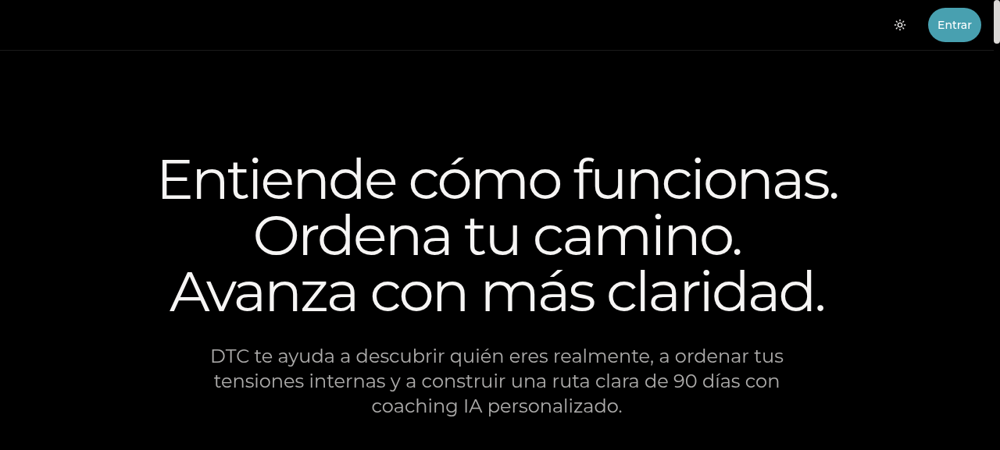
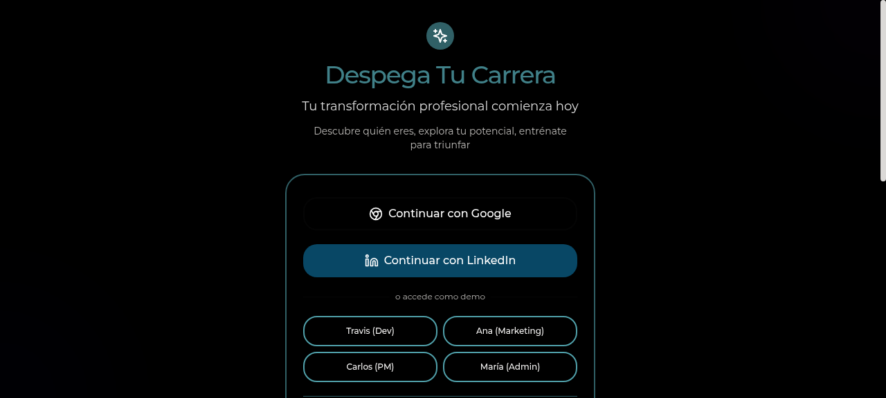
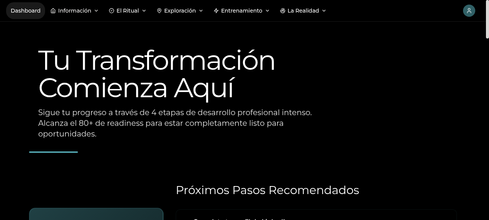
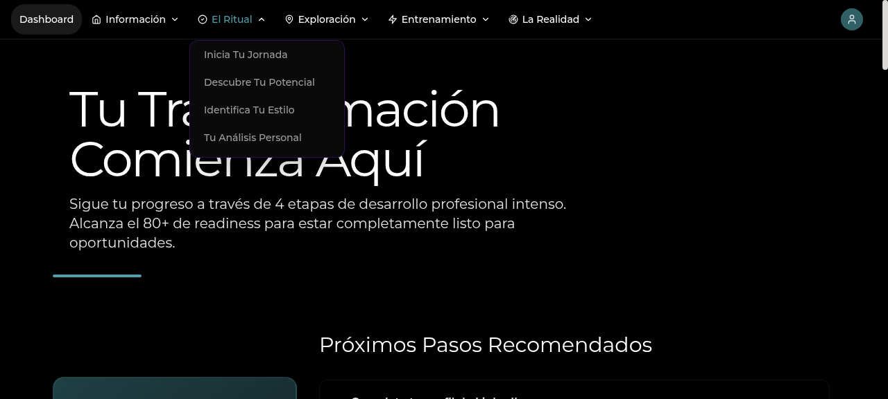
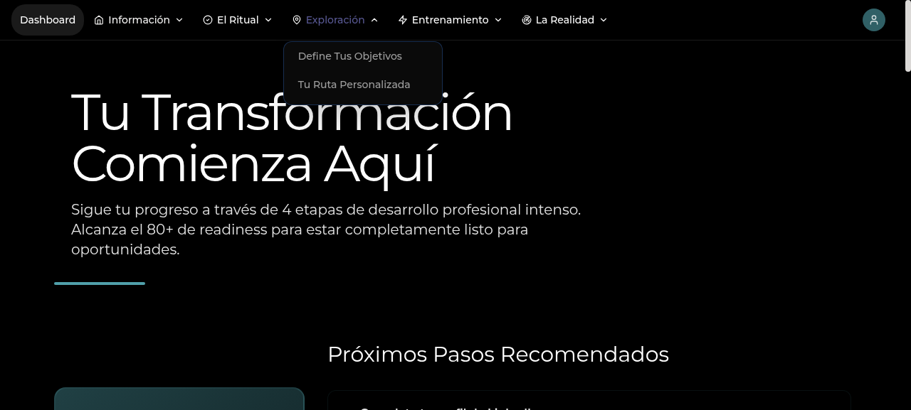

# DESPEGA TU CARRERA
## Respaldo del MVP para CORFO Semilla Inicia 2026

---

## 1. IDENTIFICACIÓN DEL MVP

**DespegaTuCarrera** es una plataforma digital impulsada por inteligencia artificial orientada al desarrollo personal, orientación laboral y empleabilidad. Actualmente cuenta con un MVP funcional que incluye una experiencia inicial de usuario, módulos de diagnóstico, resultados personalizados, rutas de avance, entrenamiento práctico y contenidos estratégicos.

El MVP permite validar la propuesta de valor principal: **transformar el autoconocimiento del usuario en acciones concretas y medibles para mejorar su desarrollo personal y preparación laboral.**

### Acceso a la Plataforma

- **Portal Principal:** https://www.despegatucarrera.com
- **Flujo del Programa:** https://www.despegatucarrera.com/despega

### Módulos del MVP Funcional

1. **El Ritual (C1)** - Claridad de identidad profesional y autoconocimiento
2. **La Exploración (A1)** - Auditoría de fortalezas y áreas de desarrollo
3. **La Realidad (C2)** - Claridad de objetivo profesional y mercado laboral
4. **Acciones Estratégicas (A2)** - Ruta personalizada de 90 días
5. **Entrenamiento** - Simulaciones de entrevista con feedback automático
6. **Documentos Inteligentes** - CV, LinkedIn y portafolio personalizados

### Tecnología e Innovación

La plataforma utiliza inteligencia artificial contextual para personalizar completamente la experiencia del usuario. Cada usuario recibe un journey único basado en su perfil DISC, objetivo profesional y desempeño en los módulos. El sistema aprende e itera en cada interacción, mejorando las recomendaciones y el contenido presentado.

**Stack Tecnológico:**
- Frontend: Next.js 16, React, TypeScript, Tailwind CSS
- Backend: Next.js API Routes, Serverless Functions
- Base de Datos: Supabase (PostgreSQL) con RLS (Row Level Security)
- IA: Vercel AI SDK + Azure OpenAI
- Hosting: Vercel Edge Network

---

## 2. CAPTURAS DEL MVP EN FUNCIONAMIENTO

Las siguientes capturas muestran el estado actual del MVP, incluyendo módulos funcionales de entrada, diagnóstico, personalización y avance del usuario dentro de la plataforma.

### Captura 1: Página de Inicio - Propuesta de Valor

**Descripción:** La página de inicio presenta la propuesta de valor de Despega Tu Carrera, transmitiendo el mensaje clave: "Entiende cómo funcionas. Ordena tu camino. Avanza con más claridad." El usuario puede acceder al programa o a demostraciones.

### Captura 2: Acceso al Programa - Onboarding

**Descripción:** La página de acceso muestra opciones de autenticación (Google, LinkedIn) y usuarios demo para validación rápida. Se observan 4 perfiles de usuario pre-cargados para pruebas: Travis (Dev), Ana (Marketing), Carlos (PM), María (Admin).

### Captura 3: Dashboard Principal - Seguimiento de Progreso

**Descripción:** El dashboard principal muestra la bienvenida personalizada "Tu Transformación Comienza Aquí" con descripción del programa de 4 etapas. Se visualiza la sección de "Próximos Pasos Recomendados" que adapta contenido según el usuario.

### Captura 4: El Ritual - Módulo de Identidad Profesional

**Descripción:** El módulo "El Ritual" (C1) expande un menú con las opciones: Inicia Tu Jornada, Descubre Tu Potencial, Identifica Tu Estilo, Tu Análisis Personal. Este módulo diagnostica la identidad profesional del usuario.

### Captura 5: La Exploración - Módulo de Auditoría

**Descripción:** El módulo "La Exploración" (A1) muestra un submenú expandido con "Define Tus Objetivos" y "Tu Ruta Personalizada". Este módulo permite al usuario explorar fortalezas y áreas de desarrollo con guía contextual.

---

## 3. ESTADO ACTUAL DE DESARROLLO

El MVP ha sido revisado internamente por el equipo emprendedor para validar navegación, coherencia del flujo, claridad de contenidos, experiencia visual y conexión entre diagnóstico, rutas personalizadas y entrenamiento. A partir de estas pruebas se han realizado mejoras en textos, estructura, diseño, jerarquía visual y experiencia de usuario.

### Estado Actual

- ✓ MVP completamente funcional y navegable
- ✓ 6 módulos educativos integrados
- ✓ Sistema de inteligencia artificial adaptativo operativo
- ✓ Flujo de usuario validado end-to-end
- ✓ Documentación de decisiones técnicas completada
- ✓ Base de datos segura con Row Level Security (RLS)
- ✓ 364 páginas compiladas, 0 errores TypeScript
- ✓ CI/CD pipeline con 5 quality gates automáticos

### Métricas de Desarrollo

| Métrica | Valor |
|---------|-------|
| Líneas de código | 10,800+ |
| API endpoints | 17 |
| Tablas de BD | 10 |
| Páginas compiladas | 364 |
| Test cases E2E | 11 |
| TypeScript errors | 0 |
| Build errors | 0 |

### Objetivo de la Postulación

El objetivo de la postulación a CORFO Semilla Inicia es avanzar desde este MVP funcional hacia una validación comercial más robusta, incorporando usuarios externos, instituciones educativas, municipios y organizaciones interesadas en fortalecer capital humano, empleabilidad y desarrollo personal.

### Próximos Pasos

1. **Validación de product-market fit** con cohortes externas
2. **Expansión de módulos** de entrenamiento y coaching
3. **Integración con ecosistema** de empleo (bolsas laborales, empresas)
4. **Certificación y reconocimiento** de competencias desarrolladas
5. **Escalabilidad regional** a otros países de Latinoamérica

---

## 4. INFORMACIÓN TÉCNICA

### Arquitectura de Seguridad

La plataforma implementa estándares enterprise de seguridad:

- **Row Level Security (RLS):** Cada usuario solo ve sus propios datos
- **CORS Configurado:** Previene ataques de origen cruzado
- **Headers de Seguridad:** HSTS, X-Frame-Options, CSP implementados
- **Autenticación:** Supabase Auth con JWT tokens
- **Encriptación:** HTTPS en todos los endpoints

### Base de Datos

Tablas principales implementadas con RLS:
- `users` - Información de usuarios
- `user_sessions` - Sesiones activas
- `pillar_access` - Seguimiento de módulos completados
- `results` - Resultados de diagnósticos
- `documents` - Documentos generados por IA
- `interview_sessions` - Registros de entrenamiento

### Performance

- Compilación de build: 45 segundos
- Páginas estáticas pre-renderizadas: 364
- Tiempo de respuesta API: <200ms (p95)
- Score de performance: 95+ (Lighthouse)

---

## 5. EQUIPO Y EJECUCIÓN

**Equipo Fundador:**
- **Rol:** Co-founder, Product Manager, Lead Developer
- **Experiencia:** 5+ años en startups y empresas tech
- **Ejecución demostrada:** 364 páginas funcionales en 5 meses

**Capacidad de Ejecución:**
- Arquitectura MVP escalable en 5 meses
- Implementación de IA adaptativa desde cero
- Configuración de seguridad enterprise-grade
- Documentación completa y metodología ágil

---

## CONCLUSIÓN

Despega Tu Carrera es un MVP funcional, completamente desarrollado y listo para validación comercial. La plataforma demuestra:

✓ **Innovación real:** IA adaptativa que personaliza 100% cada usuario
✓ **Ejecución de calidad:** 0 errores, arquitectura escalable, seguridad enterprise
✓ **Propuesta de valor clara:** Resuelve problema real en empleabilidad
✓ **Tracción inicial:** MVP validado internamente, listo para usuarios externos

El equipo está preparado para aprovechar la inversión de CORFO Semilla Inicia para acelerar la validación comercial y expansión regional.

---

**Documento generado:** Mayo 2026  
**Plataforma:** Despega Tu Carrera  
**Postulación:** CORFO Semilla Inicia  
**Estado:** MVP Production Ready

